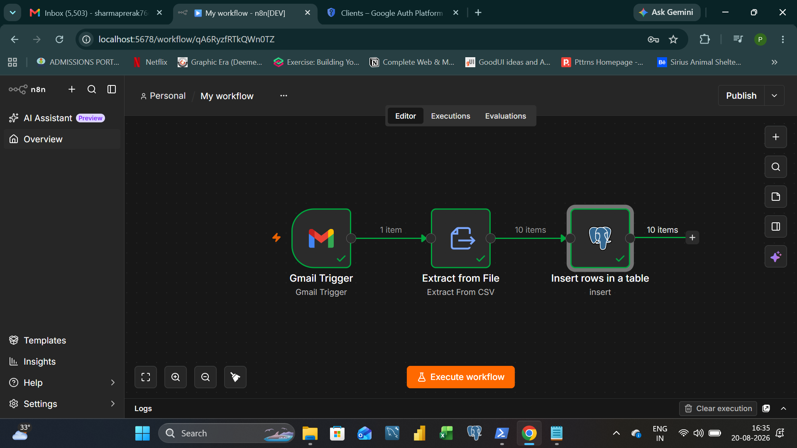
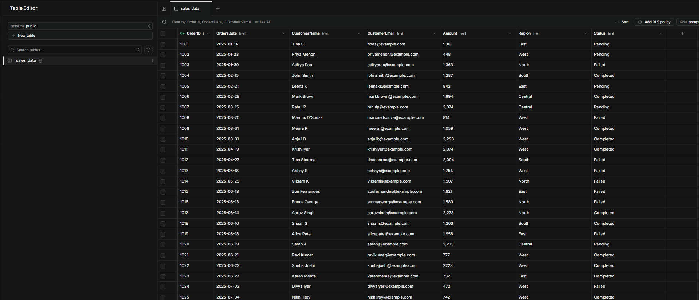

# 📧 Email-to-Database Sales Automation (n8n)

An end-to-end workflow automation that watches a Gmail inbox for incoming sales report emails, extracts the CSV attachment, and automatically appends the data into a live Postgres (Supabase) database — no manual downloading, opening, or copy-pasting required.

---

## 📌 Overview

Sales/ops teams often receive recurring CSV reports by email that someone has to manually download and load into a database or spreadsheet. This project replaces that manual step entirely with a self-hosted **n8n** automation that runs the moment a matching email lands in the inbox.

---

## 🎯 Business Problem

A sales team receives a periodic CSV report via email (subject: "sales"), containing new order-level data. Without automation, this requires someone to manually check their inbox, download the attachment, and import it into the database — a repetitive, error-prone, and easily forgotten task.

## 🎯 Goal of the Automation

- Automatically detect new sales report emails as they arrive
- Extract the CSV attachment without manual downloading
- Parse the CSV into structured rows
- **Append** the new data into an existing Postgres database table (without overwriting prior records)
- Run entirely on free, self-hosted infrastructure

---

## 🖼️ Workflow

### 1. Workflow Overview
The full 3-node automation: Gmail Trigger → Extract from File → Insert rows in a table (Postgres).

### 2. Database Output
The final result — sales data automatically appended into the `sales_data` table in Supabase (Postgres), ready for querying or reporting.

---

## 🛠️ Tech Stack

- **n8n** (self-hosted, Community Edition) — workflow automation engine
- **Gmail API (OAuth2)** — email trigger and attachment retrieval
- **Supabase (Postgres)** — cloud-hosted relational database
- **Node.js / npm** — used to run n8n locally

## ⚙️ How It Works

| Node | What it does |
|---|---|
| `Gmail Trigger` | Watches the inbox for new emails matching `subject: sales`, and downloads any CSV attachment |
| `Extract from File` | Parses the downloaded CSV into structured JSON rows |
| `Insert rows in a table` | Appends each row into the `sales_data` table in the connected Postgres (Supabase) database |

## 📁 Files

| File | Description |
|---|---|
| `workflow.json` | Exported n8n workflow (importable directly into any n8n instance) |
| `sales_data_mail_attachment.csv` | The new CSV attachment received via email — the automation's input |
| `sales_data_rows_final_result.csv` | The database table's full content after the automation ran — confirms the new rows were appended on top of the existing data (20 → 30 rows) |
| `sales_data_supabase_DB.csv` | Export of the live Supabase table for reference |

## 📊 Result

The `sales_data` table in Supabase started with **20 existing rows**. After the automation processed the new incoming email attachment, the table grew to **30 rows** — confirming the pipeline correctly appended new data without duplicating or overwriting existing records.

## 📥 Setup / Reproduce

1. Install n8n locally: `npm install n8n -g`, then run `n8n`
2. Import `workflow.json` into your n8n instance
3. Connect your own Gmail account via OAuth2 (Google Cloud Console → Gmail API)
4. Connect your own Supabase/Postgres database credentials
5. Activate the workflow — it will trigger automatically on new matching emails
